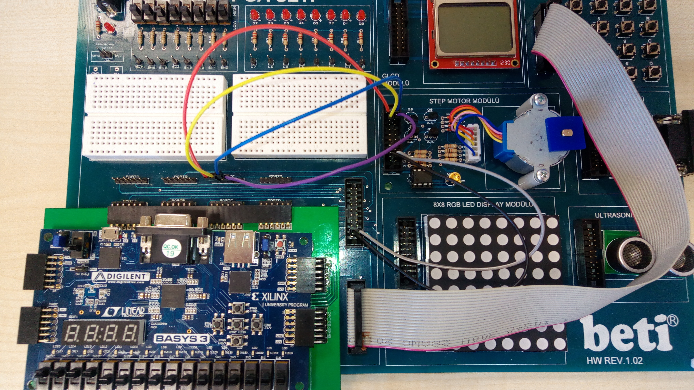
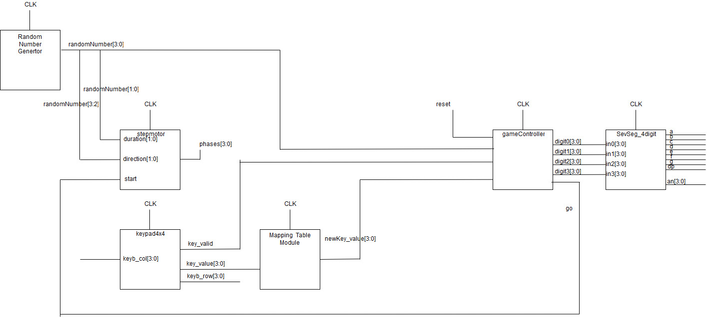

# Game-of-Codes
Basys-3 game made using System Verilog

### Project description: 
A sequence of random codes is generated by the hardware inside the FPGA. The stepper motor module on the Beti board plays this sequence by applying unique movements for each code. The player person watches the movements of stepper motor and enters the corresponding ASCII character sequence using the 4x4 keypad on the Beti board. For each correct/incorrect character, the player earns/loses 1 point. Total points are displayed on the 7-segment display module on the BASYS-3 board.

#### Notes:
- This game was made as a course project for CS223 - Digital Design.
- It was a one person project.
- The setup includes Basys-3 board and the Beti board provided by the school.

### Gallery
  
  
  
